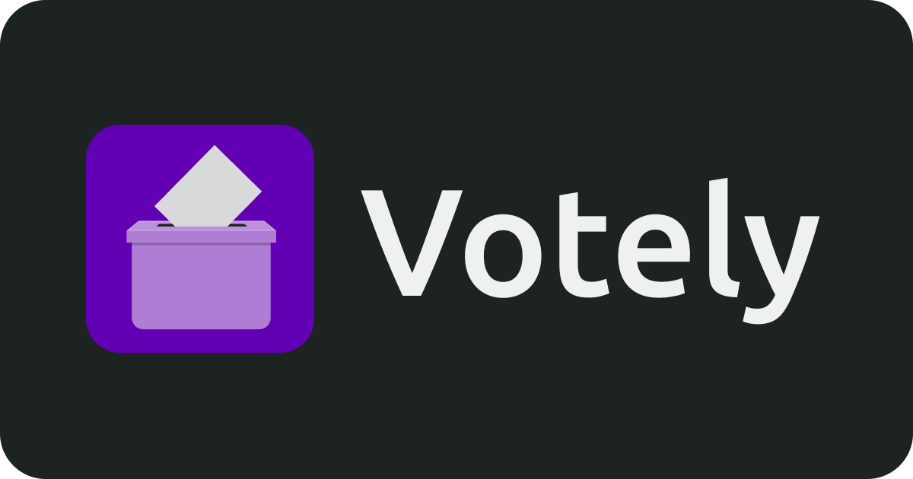
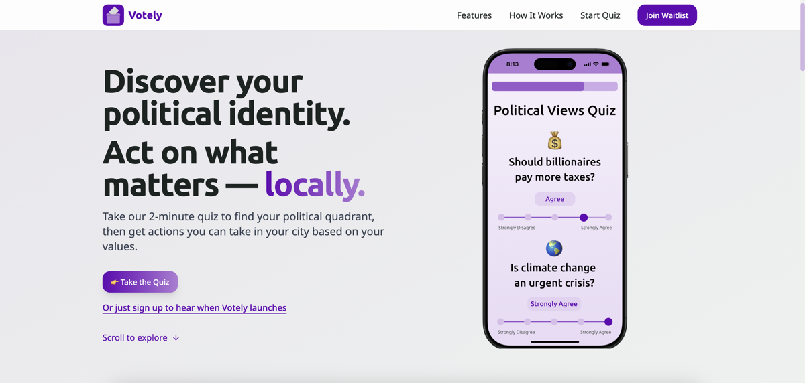
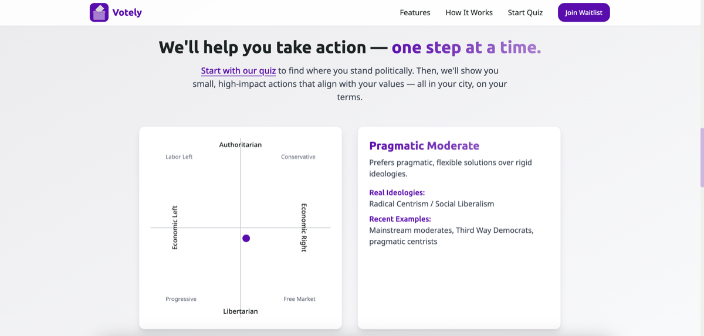
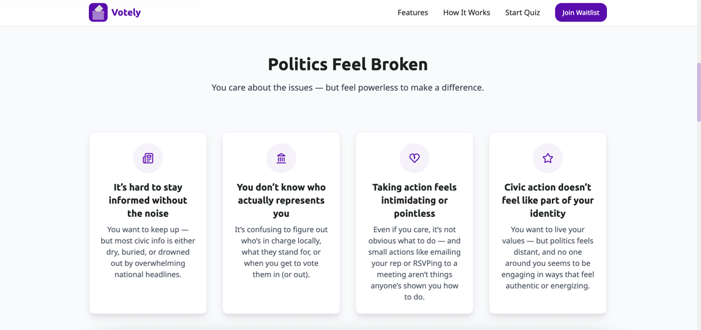

<div align="center">



# Votely 🗳️

Modern civic engagement platform helping young people discover their political values and take meaningful local action.

[](https://votely.com)
[](https://quiz.getvotely.com)

</div>

## What Votely Does

Votely bridges the gap between political awareness and local action. Instead of endless debates about national politics, we help users understand their core values and channel them into concrete civic engagement in their communities.



*Clean, approachable landing page designed to welcome first-time civic participants*


*Interactive political quiz helping users discover their values*



*Personalized political compass placing users on economic and social axes*

## Why This Platform Exists



**The Problem:** Young people feel disconnected from politics, seeing it as distant, divisive, or irrelevant to their daily lives. Traditional civic engagement feels intimidating and abstract.

**Our Solution:** Votely makes politics personal and actionable. Our 2-minute quiz helps users understand their values, then connects them with specific local opportunities that match their beliefs and interests.

**Impact Goals:** Transform political apathy into civic participation by making local democracy accessible, engaging, and results-oriented for a new generation.

## How Votely Works

<div align="center">


**Learn** your values → **Act** on your beliefs → **Map** your impact

</div>

## Platform Components

### 📊 Political Compass Quiz
- **Quick Assessment**: 2-minute questionnaire covering economic and social issues
- **Visual Results**: Interactive political compass showing user's position
- **Personalized Labels**: Clear explanations of political alignment (e.g., "Progressive," "Libertarian")
- **Value Breakdown**: Detailed analysis of economic vs. social political preferences

### 🏛️ Local Action Hub (In Development)
- **Targeted Recommendations**: City-specific civic opportunities based on quiz results
- **Action Tracking**: Monitor personal civic engagement and community impact
- **Event Integration**: Local town halls, volunteer opportunities, and advocacy events
- **Progress Metrics**: Measure how individual actions contribute to community change

### 🎯 Smart Matching System
- **Value-Based Recommendations**: Suggests actions aligned with user's political compass results
- **Location Awareness**: Focuses on opportunities within user's city and district
- **Skill Matching**: Connects users with ways to contribute their unique talents
- **Time Commitment Options**: Accommodates different availability levels

## Technical Architecture

### Frontend Stack
- **React & TypeScript**: Type-safe, component-based architecture
- **Next.js**: Server-side rendering for quiz application performance
- **Vite**: Fast development and optimized builds for landing page
- **Tailwind CSS**: Utility-first styling for consistent, responsive design
- **shadcn/ui**: High-quality, accessible component library

### Backend & Infrastructure  
- **Firebase Firestore**: Real-time database for quiz results and user data
- **Firebase Authentication**: Anonymous auth for privacy-focused data collection
- **Vercel Deployment**: Edge-optimized hosting for both applications
- **Google Analytics**: Privacy-conscious user behavior tracking

### Data & Privacy
- **Anonymous by Default**: No personal information required for quiz participation
- **Opt-in Data Collection**: Users choose whether to share results for research
- **Local Storage**: Quiz results stored client-side unless explicitly shared
- **GDPR Compliant**: European privacy standards implemented throughout

## Key Features

✅ **Interactive Political Assessment** - Comprehensive values-based questionnaire  
✅ **Visual Results Display** - Dynamic political compass with detailed breakdowns  
✅ **Mobile-Responsive Design** - Optimized experience across all devices  
✅ **Privacy-First Architecture** - Anonymous usage with optional data sharing  
✅ **Real-time Data Collection** - Firebase integration for research insights  
✅ **SEO Optimized** - Server-side rendering for discoverability  

## Project Structure

```
Votely/
├── votely-landing/          # Marketing site (React + Vite)
│   ├── src/components/      # Reusable UI components
│   ├── src/pages/          # Route components and legal pages
│   └── public/             # Static assets and manifest
├── votely-quiz/            # Quiz application (Next.js)
│   ├── app/                # Next.js 13+ app directory
│   ├── lib/                # Firebase config, quiz logic, utilities
│   └── public/             # Static assets and icons
└── design-assets/          # Brand assets, mockups, and resources
    ├── brand/              # Logos, colors, and visual identity
    ├── app/                # UI mockups and wireframes
    └── politicians/        # Stock photos for content
```

## How to Get It Running

### Prerequisites
- Node.js 18+ and npm for package management
- Firebase project with Firestore enabled
- Git for cloning the repository

### Landing Page Setup

1. **Clone and Navigate**
   ```bash
   git clone https://github.com/juleslemee/Votely.git
   cd Votely/votely-landing
   ```

2. **Install Dependencies**
   ```bash
   npm install
   ```

3. **Configure Firebase**
   ```bash
   # Add your Firebase config to src/lib/firebase.ts
   # Copy from Firebase Console > Project Settings > Web App
   ```

4. **Run Development Server**
   ```bash
   npm run dev
   # Open http://localhost:5173
   ```

### Quiz Application Setup

1. **Navigate to Quiz Directory**
   ```bash
   cd ../votely-quiz
   ```

2. **Install Dependencies**
   ```bash
   npm install
   ```

3. **Configure Environment**
   ```bash
   # Add Firebase config to lib/firebase.ts
   # Ensure same project as landing page for data consistency
   ```

4. **Start Development Server**
   ```bash
   npm run dev
   # Open http://localhost:3000
   ```

### Production Deployment

Both applications are configured for Vercel deployment:

```bash
# Deploy landing page
cd votely-landing && vercel

# Deploy quiz application  
cd votely-quiz && vercel
```

## Current Development Status

- ✅ **MVP Complete**: Functional quiz with results calculation
- ✅ **Design System**: Consistent branding and UI components  
- ✅ **Data Collection**: Firebase integration for analytics
- ✅ **Legal Compliance**: Privacy policy, terms of service, cookie policy
- 🚧 **Local Action Hub**: City-specific recommendations in development
- 🚧 **User Accounts**: Optional profiles for tracking civic engagement
- 🚧 **Action Database**: Curated local opportunities and events

## Research & Impact

### Quiz Validation
- **Political Science Basis**: Questions derived from established political science research
- **Scoring Algorithm**: Mathematical model placing users on two-dimensional political spectrum
- **Result Accuracy**: Continuous calibration based on user feedback and demographic analysis

### Civic Engagement Research
- **Anonymous Analytics**: Aggregate data on political distribution and engagement preferences
- **Effectiveness Tracking**: Measuring conversion from quiz completion to civic action
- **Community Impact**: Monitoring local election participation and volunteer engagement

## Future Enhancements

**Phase 1: Local Integration**
- Government API connections for real-time civic data
- Integration with Eventbrite, Meetup for local political events
- Partnership with local newspapers for timely civic information

**Phase 2: Community Features**  
- User groups based on geography and political alignment
- Action coordination tools for grassroots organizing
- Impact tracking dashboard showing collective community engagement

**Phase 3: Mobile & Expansion**
- Native iOS/Android applications
- Multi-language support for diverse communities  
- Integration with voter registration and ballot information APIs

## Technologies Used

<div align="center">


</div>

- **Frontend**: React, TypeScript, Next.js, Tailwind CSS
- **Backend**: Firebase (Firestore, Auth, Hosting)
- **Development**: Vite, ESLint, Prettier
- **Deployment**: Vercel, Firebase Hosting
- **Analytics**: Google Analytics, Firebase Analytics
- **Design**: Figma, shadcn/ui component system

## License

MIT License - See LICENSE file for open-source usage permissions.